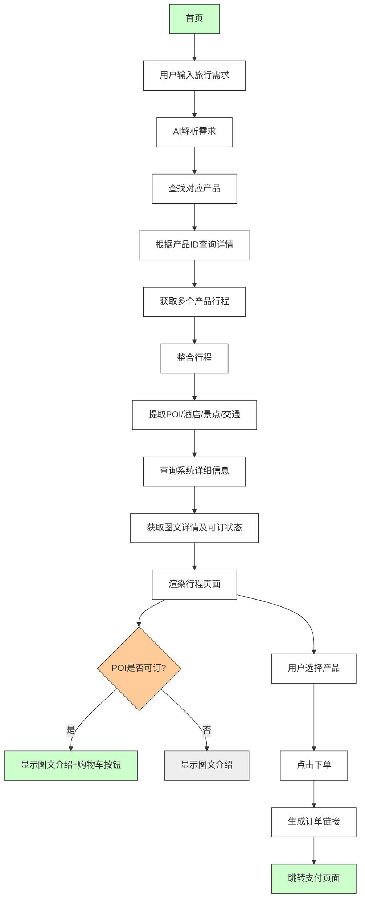

# Aura-Trip

```mermaid
graph TD
    A[首页] --> B[用户输入旅行需求]
    B --> C[AI解析需求]
    C --> D[查找对应产品]
    D --> E[根据产品ID查询详情]
    E --> F[获取多个产品行程]
    F --> G[整合行程]
    G --> H[提取POI/酒店/景点/交通]
    H --> I[查询系统详细信息]
    I --> J[获取图文详情及可订状态]
    J --> K[渲染行程页面]
    K --> L{POI是否可订?}
    L -- 是 --> M[显示图文介绍+购物车按钮]
    L -- 否 --> N[显示图文介绍]
    K --> O[用户选择产品]
    O --> P[点击下单]
    P --> Q[生成订单链接]
    Q --> R[跳转支付页面]

    style A fill:#cfc,stroke:#333
    style R fill:#cfc,stroke:#333
    style L fill:#ffcc99,stroke:#333
    style M fill:#cfc,stroke:#333
    style N fill:#eee,stroke:#333

    classDef startEnd fill:#f9f,stroke:#333;
    classDef process fill:#fff,stroke:#333;
    classDef decision fill:#ffcc99,stroke:#333;
    classDef subProcess fill:#cfc,stroke:#333;

    class A,B,C,D,E,F,G,H,I,J,K,L,O,P,Q,R process
    class L decision
    class M,N subProcess
    class A,R startEnd
```